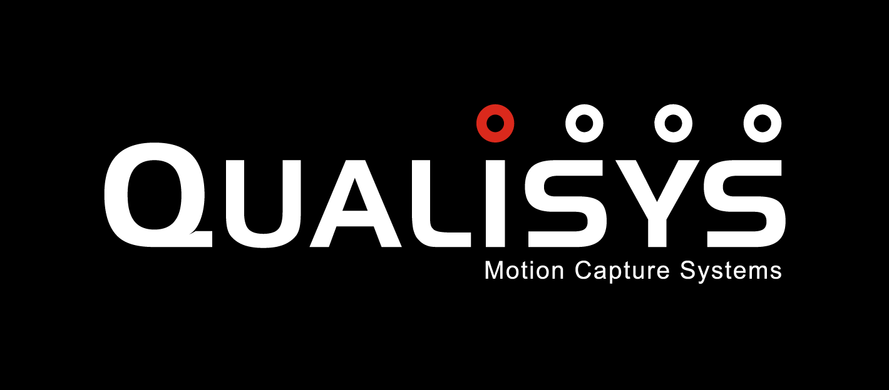

# ROS Driver for Motion Capture Systems

&emsp;


This package contains ROS drivers for two different motion capture systems,**VICON** And **QUALISYS**.

## License
For the VICON driver, we use the [offical SDK](http://www.vicon.com/products/software/datastream-sdk).

For the QUALISYS driver, we use the interface from [Qualisys2Ros](https://github.com/omwdunkley/Qualisys2Ros).

For the rest of the software, the license is Apache 2.0 wherever not specified.

## Compiling
This is a catkin package. Make sure the package is on `ROS_PACKAGE_PATH` after cloning the package to your workspace. Drivers for different motion capture system can be independently compiled.

```
cd your_work_space
catkin_make --pkg mocap_{sys} --cmake-args -DCMAKE_BUILD_TYPE=Release
```

This will compile the drivers for `{sys}`

## Example Usage

**Common Parameters**

`server` (`string`)

Address of the server of the motion capture system to be connected.

`frame_rate` (`int`, `default: 100`)

The frame rate of the motion capture system

`max_accel` (`double`, `default: 10.0`)

The max possible acceleration which serves to construct the noise parameters.

`publish_tf` (`bool`, `default: false`)

If set to true, tf msgs for the subjects are published.

`fixed_frame_id` (`string`, `mocap`)

The fixed frame ID of the tf msgs for each subject. Note that the child frame id is automatically set to the name of the subject.

`model_list` (`vector<string>`, `default: []`)

A vector of subjects of interest. Leave the vector empty if all subjects are to be tracked.

**Published Topics**

`/{mocap_sys}/{subject_name}/odom` (`nav_msgs/Odometry`)

Odometry message for each specified subject in `model_list`.

To be compatible with the name of the topics published of `vicon_odom` in [vicon repo of KumarRobotics](https://github.com/KumarRobotics/vicon), you can uncomment the following line in the launch file:
`<remap from="{mocap_sys}/{subject_name}/odom" to="/{subject_name}/odom">`

**Node**

`roslaunch {mocap_sys} {sys}.launch`

For example,

`roslaunch mocap_vicon vicon.launch`

## FAQ

1. Will the msgs be delayed if the driver is handling several subjects?
   The driver is multi-threaded. It uses different threads to process the msg from different subjects. So, emmmmm, don't worry =).

2. How to calibrate the transformation between the subject frame (centered at the centroid of the markers) and the body frame of a robot?
   This functionality is not provided, since few people use that now. If you really want that, please consider [vicon repo of KumarRobotics](https://github.com/KumarRobotics/vicon) or [vicon_bridge repo of ethz-asl](https://github.com/ethz-asl/vicon_bridge).

## Bug Report

Prefer to open an issue. You can also send an e-mail to sunke.polyu@gmail.com.

## OSX Support

You will need to compile ROS from source for OSX first. The vicon node is supported, but the qualisys node is not. There are no current plans to extend compatibility to OSX for the qualisys driver.
